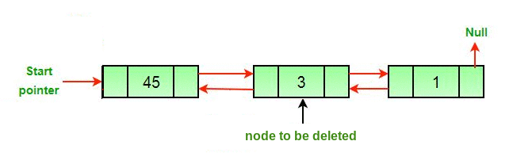

# Linked Lists

## Description
There are many types of linked lists, but for the purpose of this tutorial we will be dealing with doubly linked lists. A doubly linked list is a data structure made up of nodes. Rather than being ordered by a physical placement in memory, each node has a previous and a next pointer, as well as space for some type of data. A linked list also starts with a head and ends with a tail.


You can implement stacks, queues, and many other data structures using doubly linked lists.

### The Insert Function - O(n) Time, n=length of list
To insert a new piece of data into a linked list, we must write a function with two parameters. The first parameter is the node after which we should place the new node. The second is what data is in the new node. Our function must take the following steps to insert a new node as depicted in the image below.

1. Create a new node and give it our data(in this case node E)
2. Find the specified node after which we should place node E(in this case node B)
3. Set the 'next' attribute of node E to the 'next' attribute of node B(in this case node C)
4. Set the 'next' attribute of node B to node E
5. Set the 'prev' attribute of the node E to node B
6. Set the 'prev' attribute of the node C to node E


### The Remove Function - O(n) Time, n=length of list
To remove a node from a linked list, we must write a function with just one parameter; the node to be deleted. Our function must take the following steps to remove a node as depicted in the gif below.

1. Find the specified that needs to be deleted(in this case node 3)
2. Set the 'next' attribute of node the node before node 3(in this case node 45) to the node after node 3(in this case node 1
3. Set the 'prev' attribute of node 1 to node 45
4. Use the garbage collector to clean up node 3



### Common Errors
- When making changes in a linked list, never forget to make sure that both the prev and next pointers are correctly set for all involved nodes

## Example - Insert After Function
Below I will show you how to implement a function that can be used to insert a node after any given node. You will implement a similar function in the practice below, so make sure to understand how the function is working.

```python
def insert_after(self, value, new_value):                 # Declare the function, parameters are the new value, and the value of the node it should be placed after
    curr = self.head                                      # 'curr' is a counter, start it at the beginning
    while curr is not None:                               # starting a loop as long as there is at least one thing in the list
        if curr.data == value:                            # if the current node is the value we're searching for
            if curr == self.tail:                         # if it is also the tail
                new_node = LinkedList.Node(new_value)     # make the new node
                new_node.prev = self.tail                 # place the new node at the end by setting it's prev to the old tail
                self.tail.next = new_node                 # set the old tail's next to the new node
                self.tail = new_node                      # set tail to be the new node since it is now at the end
            else:                                         # if isn't the tail
                new_node = LinkedList.Node(new_value)     # make a new node
                new_node.prev = curr                      # set the prev of new node to curr
                new_node.next = curr.next                 # set the next of new node to curr's next
                curr.next.prev = new_node                 # set curr's next's prev to be the new node
                curr.next = new_node                      # set curr's next to be the new node
            return
        curr = curr.next                                  # if we haven't matched curr yet, keep searching
```


## Practice - Customer Priority Queue
We are designing a program for a company that does customer service. Each customer can choose one of three tiers of how much money they want to pay monthly, and the more they pay the faster they are helped by the customer service team. Your job is to put each new customer that calls in their correct place in the queue. The more stars next to a customer's name, the higher priority they are. The highest priority customers should be at the beginning of the linked list, and the lowest at the end.

Download [this starting code.](practice-files/linked-list-practice.py) Design and implement the `insert_before()`, `customer_priority()`, and `order_in_queue()` functions.

See the solution [here.](practice-files/linked-list-solution.py)
#
Images from [geeksforgeeks.org](https://www.geeksforgeeks.org)
